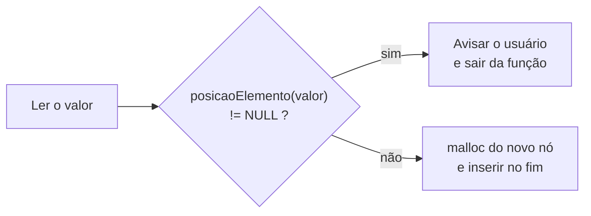

# Guia de Atividade: Implementando uma Lista Ligada em C++

> **Disciplina:** Estrutura de Dados · **Atividade 04** · **Linguagem:** C++ · **Ambiente:** Visual Studio 2022 (ou g++)
> **Entrega:** link do seu *fork* no Microsoft Teams

---

## 🗺️ Mapa da atividade

Siga os passos na ordem. O tempo é uma estimativa para você se organizar.

| Passo | O que fazer | Tempo estimado |
|:-----:|-------------|:--------------:|
| 1 | Ler a **introdução** e a **revisão dos conceitos** (seções 1 a 5) | 30 min |
| 2 | Abrir o projeto, compilar e **explorar o menu** sem alterar nada | 10 min |
| 3 | Fazer a **Tarefa 2** (buscar), a mais simples, para se aquecer | 15 min |
| 4 | Fazer a **Tarefa 1** (impedir duplicados) | 15 min |
| 5 | Fazer um **teste de mesa** no papel e só então a **Tarefa 3** (excluir) | 45 min |
| 6 | Executar o **roteiro de testes** completo | 15 min |
| 7 | Conferir o **checklist** e entregar | 5 min |

> 💡 A ordem **2 → 1 → 3** é proposital: cada tarefa usa o que você praticou na anterior.

---

## Introdução: por que usar uma Lista Ligada?

Imagine que você precisa criar uma lista de compras. Uma abordagem seria pegar uma folha de papel com um número fixo de linhas, digamos 20. Isso é como um **array**: tem um tamanho fixo. Mas e se você precisar de 21 itens? Ou se usar apenas 5? Você terá que pegar uma folha maior e copiar tudo, ou acabará desperdiçando papel.

Uma **lista ligada** é como usar notas adesivas (post-its). Cada item da sua lista vai em uma nota separada. Além do nome do item, você desenha uma seta que aponta para a próxima nota adesiva. Para adicionar um novo item, você só precisa de uma nova nota e de ajustar a seta do item anterior. Essa abordagem é flexível e só usa o espaço de que realmente precisa.

```
 Array (folha com linhas fixas):

   ┌────┬────┬────┬────┬────┬────┐
   │ 10 │ 20 │ 30 │    │    │    │   ← espaço reservado e não usado
   └────┴────┴────┴────┴────┴────┘
    [0]  [1]  [2]  [3]  [4]  [5]

 Lista ligada (post-its com setas):

   primeiro
      │
      ▼
   ┌────┬───┐     ┌────┬───┐     ┌────┬──────┐
   │ 10 │ ●─┼────►│ 20 │ ●─┼────►│ 30 │ NULL │
   └────┴───┘     └────┴───┘     └────┴──────┘
```

| | Array | Lista ligada |
|---|---|---|
| Tamanho | Fixo, definido antes | Cresce e diminui um nó por vez |
| Na memória | Elementos lado a lado | Nós espalhados, ligados por endereços |
| Inserir / remover | Deslocar elementos | Ajustar setas (ponteiros) |
| Acessar o 3º elemento | Direto: `v[2]` | Percorrer desde o início |

Nesta atividade, vamos construir essa "lista de notas adesivas" em C++, onde cada "nota" é um `nó` (struct `NO`) e cada "seta" é um `ponteiro`.

## 🎯 Objetivos de Aprendizagem

Ao concluir esta atividade, você será capaz de:

- **Definir e usar `structs`** para criar tipos de dados compostos.
- **Manipular ponteiros** para acessar e conectar estruturas na memória.
- **Utilizar os operadores `*` e `->`** corretamente no contexto de ponteiros para structs.
- **Gerenciar memória dinamicamente** com `malloc` e `free`, sem vazamentos.
- **Implementar as operações fundamentais** de uma lista ligada simples: inserção, busca e exclusão.

---

## ⚙️ Antes de começar: como abrir e executar

**Visual Studio 2022 (Windows):**
1. Faça o *fork* deste repositório e clone o seu *fork*.
2. Abra `ListaLigada/ListaLigada.sln`.
3. Pressione **Ctrl + F5** para compilar e executar.

**g++ (Linux, macOS, WSL ou Git Bash):**
```bash
g++ -std=c++17 -Wall -o lista ListaLigada/ListaLigada/ListaLigada.cpp
./lista
```

> As funções `limparTela()` e `pausar()` já funcionam nos dois ambientes.

---

## 📚 Revisão dos Conceitos Fundamentais

### 1. `struct NO`: o bloco de construção (a nota adesiva)

Em C++, uma `struct` (estrutura) nos permite agrupar variáveis de diferentes tipos em uma única unidade. Para nossa lista, cada elemento, ou **nó**, precisa guardar duas informações:

1. O dado em si (um número inteiro).
2. A localização do próximo nó na sequência (a "seta").

```cpp
struct NO {
    int valor;    // O dado que queremos armazenar.
    NO* prox;     // Um ponteiro para outro nó do mesmo tipo.
                  // É a "seta" que conecta este nó ao próximo.
};
```

```
     valor   prox
   ┌───────┬──────┐
   │  10   │  ●───┼──► próximo nó
   └───────┴──────┘
```

Quando `prox` é `NULL`, significa que chegamos ao fim da lista. Repare que `NO` contém um ponteiro para outro `NO`: é uma estrutura **autorreferenciada**, e é isso que permite encadear os nós.

### 2. Ponteiros: o endereço das coisas

Pense na memória do computador como um gigantesco armário com milhões de gavetas, cada uma com um endereço único. Um **ponteiro** é uma variável especial que não guarda um valor comum (como o número 5 ou a letra 'a'), mas sim o **endereço de uma gaveta**.

```cpp
int  x = 42;
int* p = &x;    // p guarda o ENDEREÇO de x
cout << *p;     // imprime 42: o conteúdo do endereço guardado em p
```

| Operador | Leia como… | Exemplo | Resultado |
|:--------:|------------|---------|-----------|
| `&` | "endereço de" | `&x` | o endereço onde `x` está |
| `*` | "conteúdo do endereço" | `*p` | `42` |
| `->` | "campo do nó apontado" | `aux->valor` | o mesmo que `(*aux).valor` |
| `NULL` | "aponta para lugar nenhum" | `primeiro = NULL` | lista vazia / fim da lista |

No nosso código:

- `NO* primeiro`: é um ponteiro que sempre guarda o endereço do primeiro nó da lista. Se a lista está vazia, ele vale `NULL`.
- `NO* aux`: é um ponteiro temporário que usamos para "caminhar" pela lista, indo de nó em nó.

> ⚠️ **Dois papéis para o `*`.** Na declaração, `NO* aux` significa "aux é um ponteiro para NO". Numa expressão, `*aux` significa "o nó para onde aux aponta".
>
> ⚠️ **Regra de ouro:** antes de escrever `p->algo`, garanta que `p != NULL`. Acessar um campo através de `NULL` faz o programa travar.

### 3. Como a lista fica na memória

As setas dos desenhos são, na verdade, **endereços** guardados no campo `prox`. Os endereços abaixo são ilustrativos:

```
  primeiro          end. 0x2A0           end. 0x5F0           end. 0x130
 ┌───────┐        ┌────┬───────┐      ┌────┬───────┐      ┌────┬──────┐
 │ 0x2A0 │ ─────► │ 10 │ 0x5F0 │ ───► │ 20 │ 0x130 │ ───► │ 30 │ NULL │
 └───────┘        └────┴───────┘      └────┴───────┘      └────┴──────┘
```

- Os nós **não ficam lado a lado**: cada `malloc` devolve memória onde houver espaço livre.
- `primeiro` é a **única porta de entrada**. Se você sobrescrevê-lo sem guardar o endereço antigo, perde a lista inteira.

### 4. Alocação dinâmica de memória (`malloc` e `free`)

Como não sabemos quantos elementos o usuário irá inserir, não podemos reservar um espaço fixo na memória. Usamos a alocação dinâmica para pedir memória "sob demanda".

```cpp
// Pede ao sistema operacional espaço suficiente para armazenar um 'NO'.
NO* novo = (NO*) malloc(sizeof(NO));
```

- `sizeof(NO)`: calcula o tamanho em bytes da nossa `struct`.
- `malloc`: tenta reservar esse espaço na memória. Se conseguir, retorna o endereço do espaço alocado. Se não houver memória disponível, retorna `NULL`. A memória vem **com lixo**: preencha `valor` e `prox` logo em seguida.
- `free(ponteiro)`: quando um nó não é mais necessário (por exemplo, após ser excluído), usamos `free` para devolver a memória ao sistema operacional. Depois do `free`, **esse endereço não pode mais ser usado**.

> 📌 **Regra: um `free` para cada `malloc`.** Memória alocada e nunca liberada é um **vazamento de memória** (*memory leak*): o programa vai acumulando memória que ninguém mais consegue usar.

> **Nota C vs. C++**: usamos `malloc` e `free`, que são herdados da linguagem C. Em C++ moderno, é mais comum e seguro usar os operadores `new` e `delete`. Eles funcionam de forma semelhante, mas são mais integrados à linguagem (por exemplo, chamam construtores e destrutores automaticamente). Para este exercício, vamos manter `malloc` e `free` para focar nos conceitos de ponteiros. **Nunca misture os pares** (`malloc` → `free`, `new` → `delete`).

### 5. O padrão de percurso: caminhar pela lista com `aux`

Quase todas as funções do código usam o mesmo laço para visitar os nós:

```cpp
NO* aux = primeiro;
while (aux != NULL) {
    // usa aux->valor
    aux = aux->prox;   // avança para o próximo nó
}
```

```
   aux (1º passo)   aux (2º passo)   aux (3º passo)
      │                │                │
      ▼                ▼                ▼
   ┌────┬───┐       ┌────┬───┐       ┌────┬──────┐
   │ 10 │ ●─┼──────►│ 20 │ ●─┼──────►│ 30 │ NULL │     4º passo: aux = NULL → sai do laço
   └────┴───┘       └────┴───┘       └────┴──────┘
```

Atenção à diferença entre as duas condições de parada que aparecem no código:

| Condição | Onde o laço para | Uso típico |
|----------|------------------|-----------|
| `while (aux != NULL)` | depois do último nó (`aux` vale `NULL`) | exibir, contar, buscar |
| `while (aux->prox != NULL)` | **no** último nó | achar o fim para inserir. Só é seguro se a lista **não** estiver vazia! |

### 🧠 Pare e pense

Responda antes de abrir as respostas.

<details>
<summary>1. Numa lista vazia, qual é o valor de <code>primeiro</code>?</summary>

`NULL`. Não existe nenhum nó alocado.
</details>

<details>
<summary>2. O que acontece se executarmos <code>while (aux->prox != NULL)</code> com a lista vazia?</summary>

`aux` começa valendo `NULL`, e `aux->prox` tenta acessar um campo através de `NULL`: o programa trava. É por isso que `inserirElemento` trata a lista vazia antes desse laço.
</details>

<details>
<summary>3. Por que não existe <code>lista[2]</code> numa lista ligada?</summary>

Porque os nós não estão lado a lado na memória. A única forma de chegar ao terceiro nó é seguir as setas a partir de `primeiro`.
</details>

---

## 🔍 Analisando o Código-Fonte (`ListaLigada.cpp`)

Antes de começar, entenda a estrutura do código que você recebeu:

| Menu | Função | Situação |
|:----:|--------|----------|
| — | `NO* primeiro = NULL;` | Variável global: ponto de entrada da lista |
| 1 | `inicializar()` | ✅ Pronta: esvazia a lista (usa `liberarLista()`) |
| 2 | `exibirQuantidadeElementos()` | ✅ Pronta: conta os nós percorrendo a lista |
| 3 | `exibirElementos()` | ✅ Pronta |
| 4 | `buscarElemento()` | ✏️ **Você implementa (Tarefa 2)** |
| 5 | `inserirElemento()` | ✏️ **Você modifica (Tarefa 1)**: insere no final |
| 6 | `excluirElemento()` | ✏️ **Você implementa (Tarefa 3)** |
| 7 | `liberarLista()` | ✅ Pronta: libera todos os nós ao sair |
| — | `posicaoElemento(int numero)` | ✅ Pronta: **sua principal ferramenta!** |

**`posicaoElemento(int numero)`** percorre a lista procurando um número. Ela retorna o **endereço do nó** se o encontrar, ou `NULL` caso contrário. Use-a para evitar reescrever a mesma lógica de busca várias vezes:

```cpp
NO* pos = posicaoElemento(numero);
if (pos != NULL) {
    // o número existe e pos aponta para o nó que o contém
}
```

### 🛡️ Por que `inserirElemento` lê o valor antes de alocar?

Na versão anterior deste código, o `malloc` acontecia **antes** da leitura do valor. Quem resolvesse a Tarefa 1 assim:

```cpp
NO* novo = (NO*)malloc(sizeof(NO));   // 1. aloca
cin >> novo->valor;                   // 2. lê
if (posicaoElemento(novo->valor) != NULL) {
    return;                           // 3. desiste... e o nó alocado fica perdido!
}
```

criava um **vazamento de memória**: o bloco alocado não é liberado e ninguém mais guarda seu endereço. (Medindo com a ferramenta `valgrind`, cada tentativa de inserir um duplicado perde 16 bytes.)

Agora o código **lê o valor em uma variável local e só aloca quando tem certeza de que vai inserir**. Além disso, a opção **7 - Sair** chama `liberarLista()`, devolvendo a memória de todos os nós antes de o programa terminar.

---

## 🚀 Sua Missão: Atividade Proposta

Faça um *fork* do repositório e complete as tarefas abaixo. Os comentários `TAREFA` no código mostram onde trabalhar.

> 🧩 **Dicas em camadas:** cada tarefa tem dicas escondidas. Tente primeiro sozinho; abra a Dica 1 só se travar, e a Dica 2 só se a Dica 1 não bastar.

### Tarefa 2: implementar a função `buscarElemento` (comece por ela)

Esta função deve permitir ao usuário verificar se um número está na lista.

1. Peça para o usuário digitar o número que deseja buscar.
2. Use a função `posicaoElemento()` para procurar por esse número.
3. Se a função retornar um endereço (diferente de `NULL`), exiba a mensagem: `"ENCONTRADO"`.
4. Se a função retornar `NULL`, exiba a mensagem: `"ELEMENTO NAO ENCONTRADO"`.

> Use as mensagens **exatamente** como estão escritas acima.

<details>
<summary>💡 Dica 1</summary>

Você não precisa escrever nenhum laço nesta tarefa: `posicaoElemento()` já percorre a lista por você.
</details>

<details>
<summary>💡 Dica 2</summary>

E a lista vazia? Não precisa de tratamento especial: com `primeiro == NULL`, o laço de `posicaoElemento()` nem executa e a função devolve `NULL`.
</details>

### Tarefa 1: impedir valores duplicados em `inserirElemento`

Modifique a função `inserirElemento`. Antes de alocar o novo nó, verifique se o valor digitado pelo usuário já existe. Se existir, exiba uma mensagem ao usuário e **não** realize a inserção.



<details>
<summary>💡 Dica 1</summary>

O comentário `TAREFA 1` no código marca exatamente onde a verificação deve entrar: **depois** da leitura e **antes** do `malloc`.
</details>

<details>
<summary>💡 Dica 2</summary>

Para "sair da função" sem inserir, use `return;`. Como nada foi alocado até esse ponto, não há o que liberar.
</details>

### Tarefa 3: implementar a função `excluirElemento`

Esta é a tarefa mais desafiadora. Não basta apenas encontrar o nó e usar `free`. Você precisa garantir que os ponteiros `prox` dos nós restantes continuem conectados corretamente.

> 🔑 **Ideia central: excluir = religar + liberar.** Primeiro, quem apontava para o nó passa a apontar para o seguinte; só depois o nó é liberado.

**Lógica geral:**

1. Peça para o usuário digitar o número que deseja excluir.
2. Use `posicaoElemento()` para verificar se o elemento existe. Se não existir, exiba `"ELEMENTO NAO ENCONTRADO"` e finalize.
3. Se o elemento existe, você precisará tratar dois casos principais:

**Caso A: o elemento a ser excluído é o primeiro da lista.**

- Faça o ponteiro `primeiro` apontar para o *segundo* elemento da lista (`primeiro->prox`).
- Depois de atualizar o `primeiro`, libere a memória do nó que era o antigo primeiro (guarde o endereço dele antes!).

```
 ANTES:   primeiro ──► 10 ──► 20 ──► 30 ──► NULL

 DEPOIS:  primeiro ──────────► 20 ──► 30 ──► NULL        (nó 10 → free)
```

**Caso B: o elemento está no meio ou no fim da lista.**

- Para "religar" a lista, você precisa do endereço do nó **anterior** ao que será excluído.
- Percorra a lista usando dois ponteiros: `NO* atual` e `NO* anterior` (sempre um passo atrás de `atual`).
- Quando `atual->valor` for o número a ser excluído, faça `anterior->prox` apontar para `atual->prox`. Isso efetivamente "pula" o nó `atual` da sequência.
- Agora que o nó `atual` está isolado, libere sua memória com `free`.

```
 Excluindo o 30:

 ANTES:   primeiro ──► 10 ──► 20 ──► 30 ──► 40 ──► NULL
                              ▲      ▲
                          anterior  atual

 DEPOIS:  primeiro ──► 10 ──► 20 ─────────► 40 ──► NULL   (nó 30 → free)
                              anterior->prox = atual->prox
```

> ✅ **E se for o último nó?** Então `atual->prox` é `NULL`, `anterior->prox` recebe `NULL` e `anterior` vira o novo último. O mesmo código resolve meio e fim.

> ⛔ **A ordem importa.** `free(atual);` seguido de `anterior->prox = atual->prox;` lê memória já devolvida (ponteiro pendurado). O mesmo vale para `free(primeiro); primeiro = primeiro->prox;`. **Religue antes, libere depois.**

<details>
<summary>💡 Dica 1: como saber em qual caso estou?</summary>

O endereço devolvido por `posicaoElemento()` é o nó que vai sair. Compare-o com `primeiro`: se forem iguais, é o Caso A.

Outra forma: comece com `anterior = NULL` e `atual = primeiro` e avance até achar o valor. Se ao final `anterior` ainda for `NULL`, o nó encontrado é o primeiro.
</details>

<details>
<summary>💡 Dica 2: o esqueleto do percurso com dois ponteiros</summary>

```
anterior ← NULL
atual    ← primeiro
enquanto atual->valor ≠ numero:
    anterior ← atual
    atual    ← atual->prox
```

Ao sair do laço, `atual` aponta para o nó a remover e `anterior` para o nó de trás (ou `NULL`). Falta religar e liberar.
</details>

#### ✍️ Teste de mesa (faça no papel antes de programar)

Exemplo: excluir o **30** da lista `[10, 20, 30, 40]`.

| Momento | `anterior` | `atual` | `atual->valor` | Decisão |
|---------|:----------:|:-------:|:--------------:|---------|
| Início | `NULL` | nó 10 | 10 | 10 ≠ 30 → avança |
| Após 1 passo | nó 10 | nó 20 | 20 | 20 ≠ 30 → avança |
| Após 2 passos | nó 20 | nó 30 | 30 | encontrou! religa e libera |

Resultado: `[10, 20, 40]`. Agora preencha a mesma tabela para excluir o **40** (último) e o **10** (primeiro). Em qual deles `anterior` continua `NULL`?

---

## 🐞 Erros comuns e como diagnosticar

| Sintoma | Causa provável | Como corrigir |
|---------|----------------|---------------|
| O programa fecha/trava ao excluir ou inserir | Acesso a `p->campo` com `p == NULL` | Teste o ponteiro antes de usar `->` |
| Depois de excluir o primeiro, a lista "some" | `primeiro` foi sobrescrito sem guardar o nó antigo, ou foi liberado antes de avançar | Guarde o endereço, avance `primeiro`, depois `free` |
| Depois de excluir do meio, os elementos seguintes somem | `anterior->prox` recebeu `NULL` ou não foi religado | `anterior->prox = atual->prox;` antes do `free` |
| Valores estranhos na listagem | Uso de um nó depois do `free` | Libere sempre por último e não use mais o ponteiro |
| A quantidade de elementos não bate | Algum nó ficou fora das ligações | Refaça o teste de mesa da exclusão |
| O programa entra em laço infinito | Esqueceu `aux = aux->prox;` dentro do `while` | Todo percurso precisa avançar |

---

## ✅ Roteiro de Testes

Após implementar as funções, use o menu para testar sua lógica **nesta ordem** (cada exclusão testa um caso diferente):

| # | Cenário | Ação no menu | Resultado esperado |
|:-:|---------|--------------|--------------------|
| 1 | Lista vazia | Opção 1; depois exibir, buscar 10 e excluir 10 | "Lista vazia" e "ELEMENTO NAO ENCONTRADO", **sem travar** |
| 2 | Inserção | Inserir 10, 20, 30 e exibir | `[10, 20, 30]` |
| 3 | Duplicata | Inserir 20 de novo | Aviso ao usuário; lista inalterada |
| 4 | Busca | Buscar 10; depois buscar 99 | "ENCONTRADO"; depois "ELEMENTO NAO ENCONTRADO" |
| 5 | Excluir o primeiro | Excluir 10 | `[20, 30]` |
| 6 | Excluir do meio | Inserir 40; excluir 30 | `[20, 40]` |
| 7 | Excluir o último | Excluir 40 | `[20]` |
| 8 | Único elemento | Excluir 20; exibir | "Lista vazia" |
| 9 | Quantidade | Opção 2 após cada passo acima | Acompanha cada inserção e exclusão |

> 💡 A opção 2 conta os nós **percorrendo** a lista. Se a contagem estiver errada depois de uma exclusão, alguma seta ficou mal ligada.

---

## 📝 Autoavaliação

<details>
<summary>1. O que <code>posicaoElemento(99)</code> devolve numa lista <code>[10, 20, 30]</code>?</summary>

`NULL`: ela percorre todos os nós, não encontra o 99, e `aux` termina valendo `NULL`.
</details>

<details>
<summary>2. Por que é errado fazer <code>free(atual)</code> antes de <code>anterior->prox = atual->prox</code>?</summary>

Porque `atual->prox` seria lido de uma memória já devolvida ao sistema (ponteiro pendurado). O resultado é imprevisível.
</details>

<details>
<summary>3. Ao excluir o último nó, que valor <code>anterior->prox</code> recebe?</summary>

`NULL`, porque `atual->prox` do último nó é `NULL`. Assim `anterior` passa a ser o último.
</details>

<details>
<summary>4. O que é um vazamento de memória, e em que ponto desta atividade ele poderia acontecer?</summary>

É memória alocada com `malloc` que nunca é liberada com `free` e cujo endereço se perdeu. Aconteceria se `inserirElemento` alocasse o nó e depois desistisse da inserção sem liberá-lo, ou se a exclusão religasse a lista mas esquecesse o `free`.
</details>

<details>
<summary>5. Qual a diferença entre <code>aux->valor</code> e <code>(*aux).valor</code>?</summary>

Nenhuma: `->` é apenas um atalho. Os parênteses em `(*aux).valor` são necessários porque o `.` tem precedência maior que o `*`.
</details>

---

## 🏆 Desafios extras (opcionais)

Terminou tudo? Tente estas variações, uma de cada vez:

1. **Inserir no início:** crie `inserirInicio()`. Quantas setas precisam mudar? Por que não é preciso percorrer a lista?
2. **Inserção ordenada:** mantenha a lista sempre em ordem crescente. (Dica: é parecido com a exclusão: você também precisa do nó anterior.)
3. **Contador:** mantenha uma variável `nElementos` atualizada a cada inserção e exclusão, e compare com a contagem por percurso.
4. **`new` e `delete`:** reescreva a alocação usando os operadores de C++.
5. **Exibir invertido:** mostre os elementos do último para o primeiro sem alterar a lista. (Dica: recursão.)

---

## 📋 Checklist de Entrega

Antes de submeter sua atividade, verifique se você completou todos os itens abaixo.

- [ ] A função `inserirElemento` não permite a inserção de valores duplicados.
- [ ] A função `buscarElemento` foi implementada e exibe a mensagem correta se o elemento é encontrado ou não.
- [ ] A função `excluirElemento` trata corretamente a exclusão de um elemento no início, meio e fim da lista.
- [ ] Todo nó excluído é liberado com `free`, e nenhum nó é usado depois de liberado.
- [ ] O código compila sem erros e passou por todos os cenários do roteiro de testes.
- [ ] O código está salvo e enviado (*commit* + *push*) para o seu repositório Git pessoal.

**Como entregar:**

1. Faça o *fork* deste repositório para a sua conta do GitHub.
2. Implemente as três tarefas em `ListaLigada.cpp`.
3. Faça *commit* e *push* para o seu *fork* e confira no navegador se as alterações aparecem.
4. Copie o link do seu repositório e cole-o na tarefa correspondente no **Microsoft Teams**.

---

## 📖 Glossário

| Termo | Significado |
|-------|-------------|
| **Nó** | Cada elemento da lista: um valor + um ponteiro para o próximo nó |
| **Ponteiro** | Variável que guarda um endereço de memória |
| **`NULL`** | Valor de ponteiro que não aponta para nada; marca o fim da lista |
| **`primeiro`** | Ponteiro para o primeiro nó; é a porta de entrada da lista |
| **Percorrer** | Visitar os nós um a um, seguindo os campos `prox` |
| **Alocação dinâmica** | Pedir memória durante a execução (`malloc`) conforme a necessidade |
| **Vazamento de memória** | Memória alocada que nunca é liberada e cujo endereço se perdeu |
| **Ponteiro pendurado** | Ponteiro que guarda o endereço de uma memória já liberada |
| **Teste de mesa** | Simulação manual, passo a passo, do valor das variáveis |

---

## 🔗 Recursos Adicionais e Referências

- **[Artigo] GeeksforGeeks - Linked List Data Structure**: um dos melhores recursos online, com explicações detalhadas e exemplos de código para todas as operações.
  * <https://www.geeksforgeeks.org/data-structures/linked-list/>
- **[Vídeo] Lista Encadeada - Estrutura de Dados (YouTube)**: para quem prefere um aprendizado visual, este vídeo do canal "Programação Descomplicada" explica o conceito de forma clara (em português).
  * <https://www.youtube.com/watch?v=biTMaMxWLRc>
- **[Documentação] cplusplus.com - Pointers**: para revisar a sintaxe e o conceito de ponteiros em C++.
  * <https://cplusplus.com/doc/tutorial/pointers/>
- **[Ferramenta] VisuAlgo - Linked List**: animações das operações de inserção, busca e remoção.
  * <https://visualgo.net/en/list>
